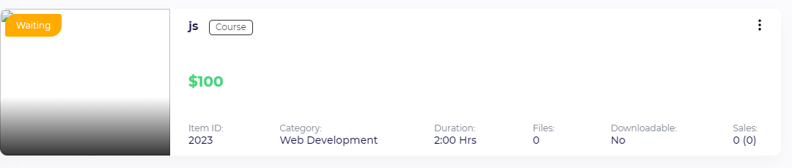

# 🎓 Mentors Arena — Graduation Project

**Mentors Arena** is a web-based mentorship and e-learning platform that connects **mentors** and **mentees** for online sessions, courses, and educational programs.  
It provides a flexible environment for creating, managing, and participating in mentorship programs using modern web technologies.

---

## 🚀 Features

### 👨‍🏫 For Mentors
- Add and manage new **courses** to share knowledge.  
  
- Choose from different **pricing plans** for each course.  
  
- Post **notices** to keep mentees updated about course changes or announcements.  
  
  

### 👩‍🎓 For Mentees
- View full **course details** before joining.  
  
- Choose a suitable **meeting time** with their mentor.  
  

---

## 🧱 System Overview

Mentors Arena provides a structured platform for education and mentorship through:
- Course creation and management  
- Subscription and pricing plans  
- Noticeboard system  
- Meeting scheduling  
- User roles (mentor / mentee)  
- Integration with APIs and third-party services (YouTube, Google Calendar, AWS)

---

## ⚙️ Tech Stack

| Layer | Technology |
|--------|-------------|
| **Frontend** | HTML, CSS, JavaScript |
| **Backend** | PHP (Laravel Framework) |
| **Database** | MySQL |
| **Version Control** | Git & GitHub |

---

## 🧠 Key Features Summary

- Mentors can create and manage courses  
- Mentors can choose pricing plans for courses  
- Mentors can post and manage notices  
- Mentees can view course details  
- Mentees can select meeting times  
- Supports live class systems (Zoom / Google Meet)  
- Multi-language support  
- Fully responsive design  

---

## 🧾 Acronyms, Abbreviations, and Definitions

| **Term** | **Description** |
|-----------|-----------------|
| **Appointment** | An arrangement to meet someone (Mentor/Mentee) at a particular time. |
| **Web-based Application** | An application that runs on the Internet. |
| **Database** | A collection of all the information managed by this system. |
| **Mentorship** | A relationship where an experienced individual (mentor) guides a junior individual (mentee). |
| **Session** | A formal meeting or series of meetings. |
| **Roadmap** | A visualization of a business or project plan over a specific timeframe. |
| **Mentor** | A professional who provides guidance and advice to mentees. |
| **Mentee** | A person seeking guidance from a mentor. |
| **Online Education** | A mode of learning using technology and the Internet to deliver educational content. |
| **Video Courses** | Pre-recorded educational content delivered through video format. |
| **Live Classes** | Real-time interactive classes via video conferencing (e.g., Zoom, Google Meet). |
| **Text Courses** | Educational content provided in written format such as articles or e-books. |
| **Public Classes** | Classes open to anyone without prior approval or membership. |
| **Private Classes** | Restricted classes requiring approval or membership. |
| **Quizzes** | Short assessments to evaluate understanding. |
| **Certification** | A credential awarded to users who demonstrate certain skills or knowledge. |
| **YouTube Integration** | Embedding YouTube videos into the Mentors Arena platform. |
| **Vimeo Integration** | Embedding Vimeo videos into the platform. |
| **AWS Integration** | Using Amazon Web Services for storage and data access. |
| **Google Calendar Integration** | Scheduling and managing meetings directly through Google Calendar. |
| **Online Meeting Booking** | Booking one-on-one or group online meetings. |
| **Instructors** | Individuals responsible for delivering educational content. |
| **Organizational Education System** | Managing and delivering content within an organization. |
| **Meeting Reminders** | Automated notifications for upcoming meetings or classes. |
| **User Permissions** | Defining access levels and roles for users. |
| **Commissions** | Platform fees or percentages for educational services. |
| **Accounting System** | Tracks and manages financial transactions. |
| **Class Support System** | Provides customer and technical support. |
| **Noticeboard** | Centralized area for announcements and updates. |
| **Subscription System** | Manages and tracks user subscriptions. |
| **Payment Gateways** | Methods for processing online payments. |
| **Offline Payments** | Enables users to pay through offline methods. |
| **SMS and Social Login** | Allows users to log in via mobile or social accounts. |
| **Live Class Systems Support** | The platform supports multiple live class systems such as Zoom or Google Meet. |
| **Multi-Language** | The platform supports multiple languages. |
| **Responsiveness** | The platform adapts and functions effectively on different screen sizes and devices. |

---

## 🖥️ Installation

```bash
# Clone the repository
git clone https://github.com/your-username/mentors-arena.git

# Navigate to the project
cd mentors-arena

# Install dependencies
composer install

# Copy environment file
cp .env.example .env

# Generate application key
php artisan key:generate

# Run the local server
php artisan serve


🌱 Future Enhancements

   - Live chat system between mentors and mentees
    
   - Video conferencing integration (Zoom API / Google Meet API)
    
   - Payment system for premium courses
    
   - Admin dashboard with analytics and course reports


  👨‍💻 Author

    Mohamed Ashraf Salah Abdelaziz
    🎯 Backend Web Developer (PHP / Laravel)
    📍 Mansoura, Egypt
    📧 Email: mohamed_ashraf4444@hotmail.com  
    🌐 GitHub: [https://github.com/salah3122001](https://github.com/salah3122001)  
    🔗 LinkedIn: [https://www.linkedin.com/in/mohamed-ashraf-14916a367](https://www.linkedin.com/in/mohamed-ashraf-14916a367)


  🏫 Education

    Bachelor’s Degree in Bioinformatics (Computer Science Field)
    Faculty of Computers and Information — Mansoura University
    📅 Graduated: June 2023
    🎓 GPA: 2.73 / 4 (Very Good)
    🏅 Capstone Project: Mentors Arena — Advanced Learning Management System

